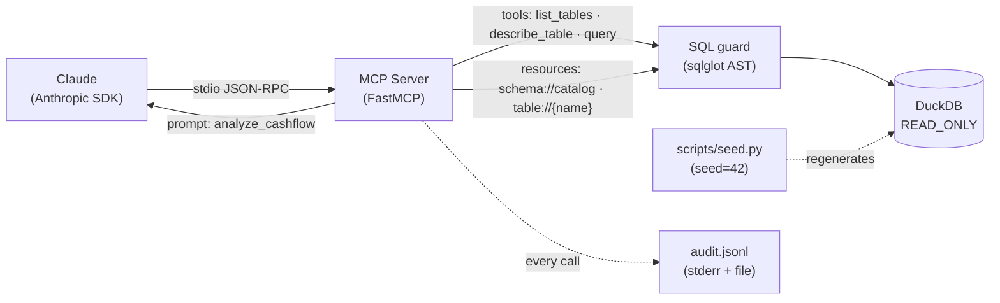
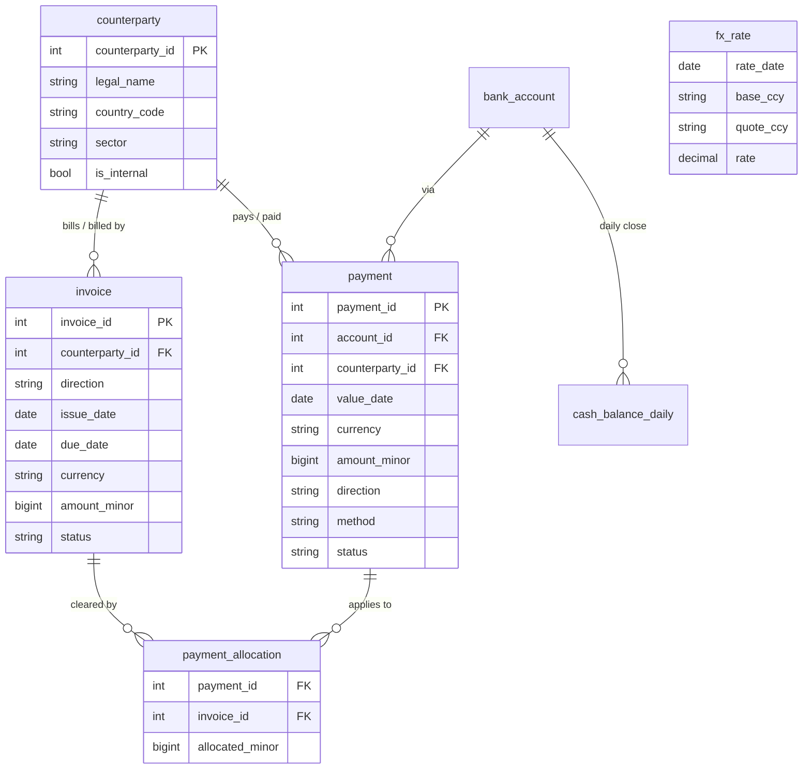

# MCP Data Warehouse Server

> Query a synthetic financial data warehouse in natural language — safely — over the [Model Context Protocol](https://modelcontextprotocol.io).

[](https://github.com/Shimiyahya/mcp-data-warehouse-server/actions/workflows/ci.yml)


An MCP server that exposes a small **treasury & payments warehouse** (DuckDB) to an LLM as MCP **resources**, **tools**, and a **prompt** — so a model like Claude can plan multi-step analytical SQL and reason over the results, while every query is forced through a read-only safety layer.

- **What it is** — a read-only MCP server over DuckDB: schema/data-dictionary as resources, plus `list_tables` / `describe_table` / `query` tools.
- **Why it's safe** — fully synthetic data, a physically **read-only** connection, **SELECT/WITH-only** validation via an AST parser, a per-table allow-list, forced row/byte caps, query timeouts, and a JSONL **audit log** of every call.
- **What's interesting** — the questions require the model to discover the schema and plan 3–4-way joins (invoices ↔ payments ↔ FX ↔ counterparties) entirely on its own.

## Architecture



## Quickstart

```bash
uv sync                              # create the venv + install deps
uv run python scripts/seed.py        # build warehouse.duckdb deterministically (seed=42)
uv run pytest -q                     # green tests — no API key needed
uv run python demo.py                # the LLM answers a multi-step question (needs ANTHROPIC_API_KEY)
```

`demo.py` reads `ANTHROPIC_API_KEY` from your environment or a local `.env` (copy `.env.example`).

### Use it as a real MCP server

**Claude Desktop** — add to `claude_desktop_config.json` (Windows: `%AppData%\Claude\…`, macOS: `~/Library/Application Support/Claude/…`), then restart:

```json
{
  "mcpServers": {
    "data-warehouse": {
      "command": "uv",
      "args": ["--directory", "/ABSOLUTE/PATH/TO/mcp-data-warehouse-server", "run", "mcp-warehouse"]
    }
  }
}
```

**Claude Code** —

```bash
claude mcp add data-warehouse -- uv --directory /ABSOLUTE/PATH/TO/mcp-data-warehouse-server run mcp-warehouse
```

(If `uv` isn't on PATH for the GUI app, use its absolute path from `which uv` / `where uv`.)

## The data

A fully **synthetic, deterministic** warehouse for a fictional company, _Northwind Pay Ltd_. No real entities, no PII — regenerated byte-identically from `scripts/seed.py` (`random.seed(42)`). Money is stored as **integer minor units** (pennies/cents) to avoid float drift; currencies are ISO-4217; FX is keyed by date so "in GBP" questions are genuinely multi-step.



Eight tables in total: `counterparty`, `bank_account`, `gl_account`, `fx_rate`, `invoice`, `payment`, `payment_allocation`, `cash_balance_daily`. Run `describe_table` (or read the `table://{name}` resource) for the full column-level data dictionary.

### Example questions it can answer

1. "Top 5 counterparties by net **GBP** cash outflow in Q3 2024 (convert EUR/USD at the value-date FX rate), and what % of each one's payable invoices are still open past their due date?"
2. "What was our 7-day rolling **minimum** cash position across all GBP accounts last quarter, and which day was tightest?"
3. "**SEPA vs SWIFT** settlement success rate by month, weighted by EUR-converted value."
4. "**Days-sales-outstanding** trend by counterparty sector over the last 6 months."

## MCP surface

### Tools
| Tool | Args | Behaviour |
| --- | --- | --- |
| `list_tables` | — | Lists the allow-listed tables with row-count estimates. |
| `describe_table` | `name` | Columns + types + a small sample + the human data-dictionary for one allow-listed table. |
| `query` | `sql`, `limit?` | Runs a **read-only** `SELECT`/`WITH` query through the safety guard; returns structured rows + a markdown preview, with explicit truncation metadata. |

### Resources
| URI | Returns |
| --- | --- |
| `schema://catalog` | The full table catalog + data dictionary as JSON. |
| `table://{name}` | Columns, types, dictionary and a sample for one table. |

### Prompts
| Name | Purpose |
| --- | --- |
| `analyze_cashflow` | A starter prompt that primes the model to explore the schema and answer a cash-flow question. |

## Security model

Fintech reviewers read this section first — so here is exactly what protects the database:

- **Synthetic data only.** No real PII; the warehouse is generated from a fixed seed.
- **Physically read-only.** DuckDB is opened with `read_only=True`; external access is disabled (`enable_external_access=false`), extension auto-load is off, and the configuration is **locked** (`lock_configuration=true`) so injected `SET` statements can't re-enable anything.
- **SELECT/WITH only, single statement.** Every query is parsed to an AST with [`sqlglot`](https://github.com/tobymao/sqlglot); anything that isn't a single top-level `SELECT`/`WITH`/set-op is rejected — this blocks the stacked-statement class of attack (e.g. `… ; DROP …`) that has bitten real database MCP servers.
- **Per-table allow-list.** Only the eight documented tables are referenceable; `information_schema`, catalog functions, and any file/network table functions (`read_csv`, `read_parquet`, …) are denied.
- **Bounded output.** A `LIMIT` is injected/clamped, results are capped by row **and** serialized-byte count, and a wall-clock timeout guards runaway queries.
- **Audit trail.** Every tool call — allowed or denied — is logged as JSON (to stderr and `logs/audit.jsonl`) with the submitted SQL, the effective SQL, the decision/reason, row count and latency. Logging goes to **stderr**, never stdout (stdout is the MCP JSON-RPC channel).

**What this does _not_ claim:** it is a portfolio demonstration, not a hardened multi-tenant product. The defenses are layered and real, but you should still run any LLM-facing database with least-privilege OS/DB credentials and in a sandbox.

## Design decisions

- **DuckDB** — an embedded analytical (columnar/OLAP) engine: zero infra, fast aggregations, and a genuine "warehouse" feel for financial analytics.
- **Official `mcp` SDK + `FastMCP` + stdio** — the canonical, dependency-light way to build an MCP server; drops straight into Claude Desktop / Claude Code.
- **Integer minor units** for money — avoids floating-point drift in sums.
- **Deterministic seed** — makes the data auditable, the demo repeatable, and the tests reliable; the `.duckdb` binary is regenerated rather than committed.

## Roadmap / limitations

- DuckDB has no native statement timeout; the wall-clock guard runs the query on a worker thread and interrupts it (best-effort).
- Cursor/keyset pagination is sketched for large result sets; current default is forced `LIMIT` + explicit truncation.
- Not production-hardened (see security note above).

## Development

```bash
make setup   # uv sync
make data    # regenerate warehouse.duckdb
make test    # pytest
make lint    # ruff check + format --check
make demo    # run the live LLM demo
```

## License

MIT — see [LICENSE](LICENSE). Data is synthetic and free to use.
